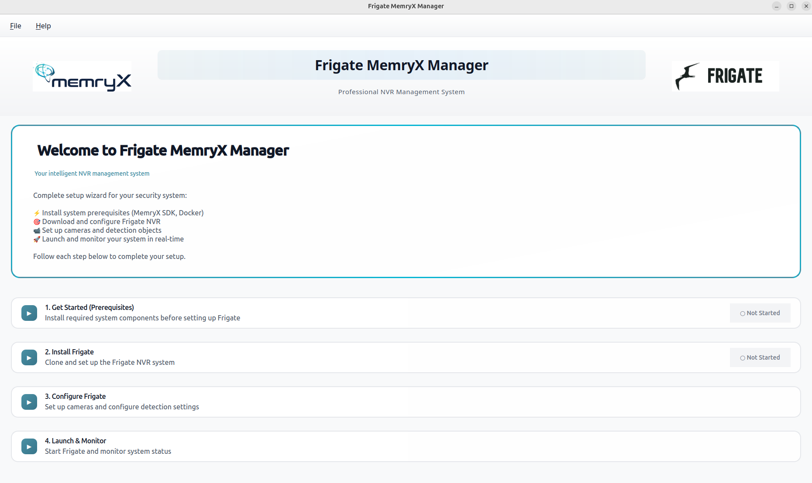

# MemryX Frigate Manager

A simple GUI application that installs and manages [Frigate NVR](https://github.com/blakeblackshear/frigate) for use with MemryX accelerators.

**Everything is handled by the GUI** - Docker, MemryX SDK, Frigate, and all dependencies are automatically installed through the application.



**[Read our step-by-step setup guide on DevBlog →](https://devblog.memryx.com/memryx-frigate-manager/)** for more detailed walkthrough.

## Quick Start

### 1. Clone the repository
```bash
git clone https://github.com/memryx/memryx-frigate-manager.git
cd memryx-frigate-manager
```

### 2. Run the application
```bash
chmod +x launch.sh
./launch.sh
```

That's it! The GUI will guide you through the rest.

## Requirements

- **Python 3.8 or newer** (that's all you need!)

The application will automatically install:
- Docker & Docker Compose
- MemryX SDK
- Frigate NVR
- All required dependencies

## What Does It Do?

The application provides a simple 3-step workflow:

1. **Install** - Automatically sets up Docker, MemryX, and Frigate
2. **Configure** - Easy camera setup and detection settings
3. **Launch** - Start and manage your Frigate instance

## Help and Discussion

Check out [our Community forum section](https://community.memryx.com/c/frigate) for support or feedback on this GUI and MemryX+Frigate integration in general!


## License

Copyright © 2026 MemryX Inc.

This project is licensed under the MIT License - see the [LICENSE](LICENSE.md) file for details.
